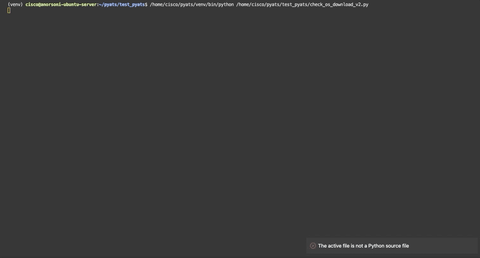

# pyATS-checks-os
Leveragging `pyATS` and `genie` to check run `pre_checks` and `post_check` on a `testbed`.

# Installing the requirements
```bash
pip install -r requirements.txt
touch sqlite/db/checks.db
python sqlite/init_database.py
```

# Using the script
## Pre-checks
```bash
python pre_checks.py --testbed /link/to/testbed.yaml
```
[Complete details are explained here.](documentation/README_pre_checks.md)


## Post-checks
```bash
python post_checks.py --testbed /link/to/testbed.yaml
```
[Complete details are explained here.](documentation/README_post_checks.md)

## Printing the diff
```bash
python check_diff.py --hostname "device_hostname" --testname "test_name" --when "when_tested"
```

## Toolbox


* `--hostname` is the complete hostname of the device, as saved in the database.
* `--testname` is the name of the test.
    - `route_summary` > `show ip route summary`
    - `routes`        > `show ip route`
    - `isis`          > `show ip isis neighbors`
    - `xconnect`      > `show xconnect all`
* `--when` is when the test has been run.
    - `both`      > for a diff `before/after`
    - `after`     > for a specific output `after`
    - `before`    > for a specific output `before`


# Demo


# pyATS documentation
The official `pyATS` documentation is available on the link below.
> https://pubhub.devnetcloud.com/media/pyats/docs/index.html